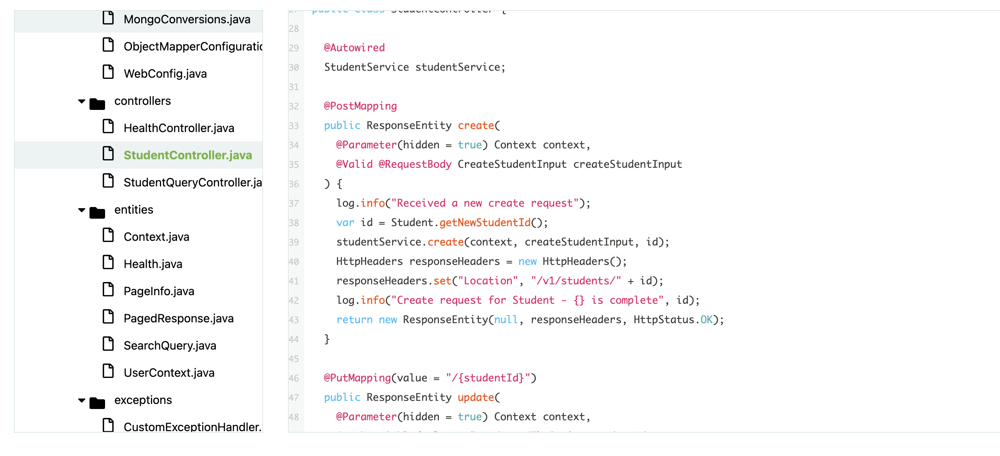

# Radical Docs 

This is a documentation for [Radical](https://radical.sh).

## Quick Start

First, run `pnpm i` to install the dependencies.

Then, run `pnpm dev` to start the development server and visit

[**Local Preview →**](http://localhost:3000/documentation)

Internal contributors can branch and contribute and raise a Pull Request.

External contributors can fork and contribute and raise a Pull Request.

## License

Repository is licensed under the MIT License.
