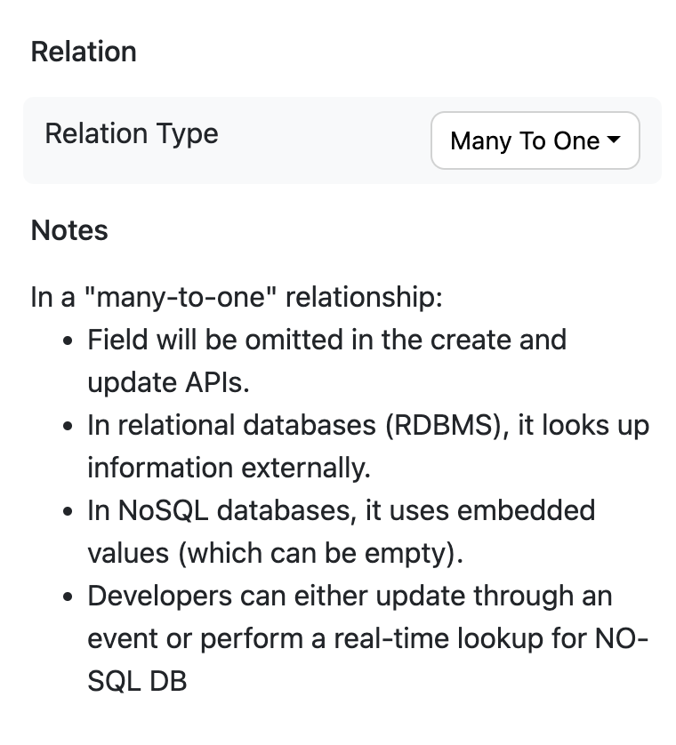

# Relationships

#### One to One

Example : Student has one to one relationship with Address

In NO-SQL address data is embedded along with student while in SQL student and adress can be stored in different tables and joined with addressId column in RDBMS

To replicate this relationship
1. Create a schema for student and add studentId
2. Create a schema for Address
3. Create a property in student schema for address

If your store selection is NO-SQL there is not need for any addressId and API can be genreated, but while choosing RDBMS it is needed

#### One to Few

Example : Order has few orderlines and Course has few course items although this is a subset of one to many, approach to handle is slightly in different.

To replicate this relationship
1. Create a schema for Order and add orderId
2. Create a schema for Orderline
3. Create a property in Order schema for orderline with Orderline and mark as list

In No-SQL databases one to few will be considered as embedded relation, while in Sql it will be considered as **One to Many** relationship with orderId as join key in the given example

#### One to Many 

Example : Department has **one to many** relationship with students. One to many leads to fetch on lot of records in RDBMS and embedding approach in NO-SQL databases will lead to limitations. 

Instead the preferred approach would be to have many to one relation ship from student to department and if any filters are required on department, filters can be applied on select all of students api

#### Many to One

Example : Student has **many to one** relationship with department. 

While creating student schema, departmentId can be added and department can be referenced as many to one relationship at schema level. These references will not need inserts / updates in API.

#### Many to Many

Example : Students and Course have may to many relationship. Although RDBMS systems support many to many relationship, and it is often treat via 3rd normal form with an additional entity enrollment or registrations

While designing in radical, this 3rd normal form entity is preferred i.e Many to Many is avoided and instead becomes many to one relationship.

Steps to for achieving registrations
1. Add a student schema with studentId as key
2. Add a course schema with coureseId as key
3. Add a schema for registration, with student and courseId. Also add references of student and course and make them as references via many to one in advanced options. 
4. Add API's for registration, this allows CRUD and other operations on registrations

Here registration is infite i.e a student can register to any number of courses. If a students has a upper limit then to one many with `List<Course>` can be used. 

